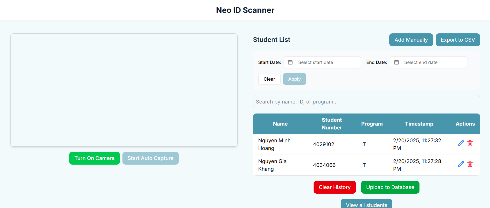

# NEO ID Scanner



This project is a web application for capturing ID information using a webcam.

## Project Setup

1. **Clone the repository**:

   ```bash
   git clone https://github.com/khangronky/scanner.git
   cd scanner
   ```

2. **Install Node.js packages**:
   Make sure you have Node.js and npm installed.

   Run the following command:

   ```bash
   npm install
   ```

3. **Install the required Python packages**:
   Make sure you have Python and pip installed.

   Make sure you have the Tesseract OCR installed. This can be found [here](https://github.com/UB-Mannheim/tesseract/wiki)

   After installing Tesseract OCR, ensure that its executable is in: `C:\ProgramFiles\Tesseract-OCR\tesseract.exe`

   Run the following command:

   ```bash
   npm run ocr:install
   ```

## Running the Project

1. **Start the Application**:
   Run the following command:

   ```bash
   npm run dev
   ```

2. **Start the OCR Service**:
   Run the following command:

   ```bash
   npm run ocr:dev
   ```

3. **Open in Browser**:
   After starting the application, open your web browser and navigate to:

   ```bash
   http://localhost:3000
   ```

## Usage

1. **Capture ID Information**: Allow access to your webcam and click the "Capture and Display ID" button.
2. **View and Manage IDs**: View captured IDs in a table, edit, delete, or add new IDs as needed.
3. **Export to CSV**: Click the "Export to CSV" button to download the ID data.

## License

This project is licensed under the MIT License - see the [LICENSE](LICENSE) file for details.
